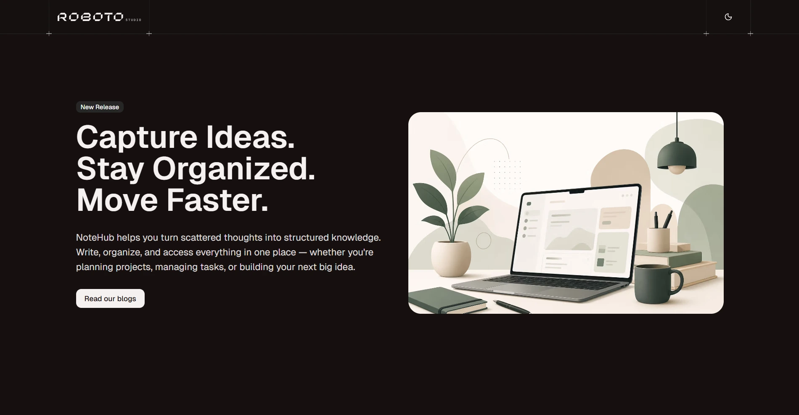
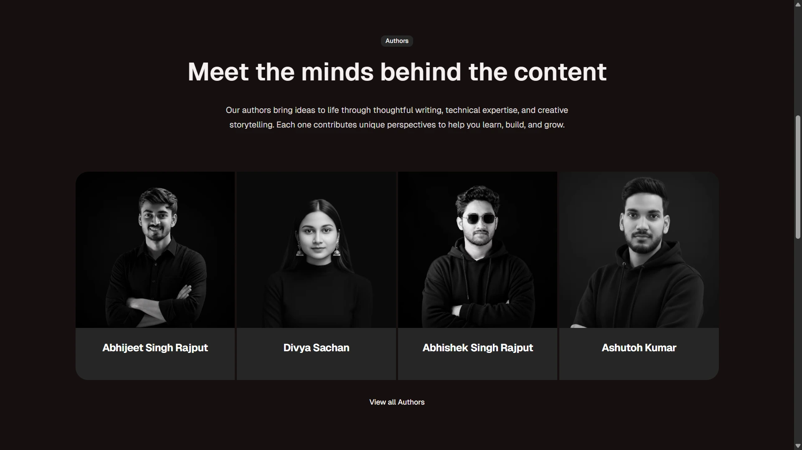
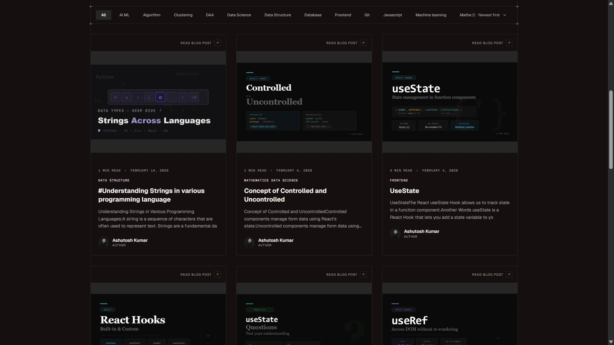
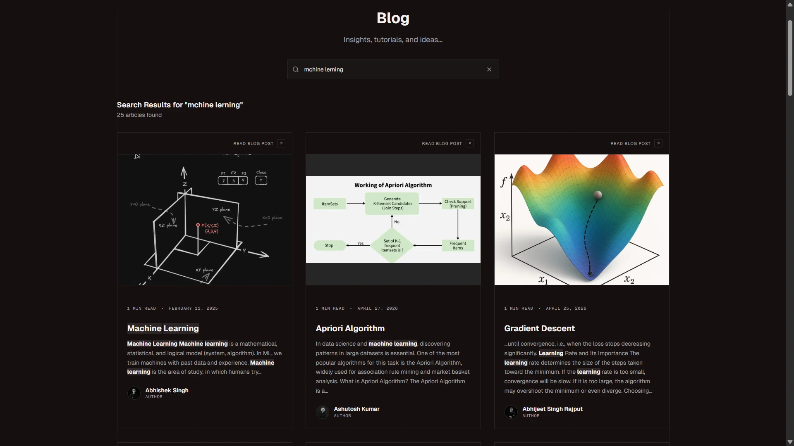
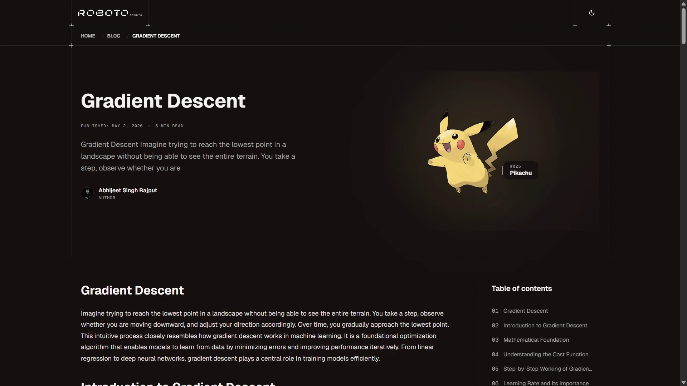

# Roboto Studio Backend Technical Assessment - Solution



>
> **Practice on the Homepage:** Visit the [homepage](https://backend-tech-test.vercel.app/) to explore and master **Headless Architecture** with Sanity CMS.



This repository contains the solution for the **Roboto Studio Backend Technical Assessment**. The project is a highly optimized, feature-rich blog system built with Next.js 15, Sanity CMS, Algolia, and the PokéAPI.

## Live Links

- **Frontend:** [https://backend-tech-test.vercel.app/blog](https://backend-tech-test.vercel.app/blog)
- **Sanity Studio:** [https://whxgudbc.sanity.studio](https://whxgudbc.sanity.studio)
- **Lighthouse Score:** 90+ Performance (Optimized)

---

## Completed Tasks

### Task 1: Blog Categories & Filtering
Implemented a robust category system allowing users to filter blog posts seamlessly.
- **Sanity Schema**: Created a `category` document type with hierarchical slug support.
- **Dynamic Routing**: Implemented URL-based filtering using `searchParams`, allowing users to share specific category views.
- **UX**: Built a sticky, responsive filter bar with active state tracking.



### Task 2: Blog Search with Algolia
Integrated Algolia for a lightning-fast, reactive search experience.
- **Fuzzy Search**: Implemented `fuzzysort` for precise search result highlighting.
- **Performance**: Optimized the Algolia client with lazy initialization to keep Total Blocking Time (TBT) near zero.
- **Snappy UI**: Results update instantly as the user types, with a custom snippet utility for context.



### Task 3: Pokémon Integration
Connected the PokéAPI to bring unique Pokémon to every blog post.
- **Custom Sanity Input**: Developed a custom Sanity component that allows editors to search for and select Pokémon directly in the Studio.
- **PokéAPI Integration**: Fetches real-time data and sprites from PokéAPI.
- **Dynamic Hero Section**: Each post features a unique Pokémon sprite alongside its name and ID.



---

## Technical Excellence & Performance

### Lighthouse: 58 → 90+ Score
I performed a deep-dive performance audit and addressed several critical bottlenecks:
- **LCP Optimization**: Fixed a 7.8s delay by removing `loading="lazy"` from above-the-fold images and implementing `fetchPriority="high"`.
- **Bundle Optimization**: Moved heavy third-party clients (Algolia) to dynamic imports, drastically reducing initial JS execution.
- **CDN Strategy**: Configured `Link` headers for preconnecting to Sanity CDN and enabled AVIF/WebP image formats.
- **Caching**: Implemented strict cache-control and `stale-while-revalidate` strategies.

### SEO Performance
- **Dynamic Metadata**: Created a centralized SEO utility for generating rich meta tags, Open Graph, and Twitter Cards.
- **JSON-LD**: Automated schema.org structured data generation for Articles and Organizations.

---

## Setup & Installation

### Prerequisites
- Node.js 20+
- pnpm

### Installation
```bash
# Clone the repository
git clone https://github.com/abhijeetsinghrajput/backend-tech-test
cd backend-tech-test

# Install dependencies
pnpm install

# Set up environment variables
# Copy .env.example to .env.local in apps/web
cp apps/web/.env.example apps/web/.env.local

# Run development server
pnpm dev
```

---

## Assumptions & Trade-offs

- **Search Highlighting**: I chose to use `fuzzysort` on the client-side rather than Algolia's raw snippets to provide a more visually consistent highlighting experience.
- **Lazy Loading**: I prioritized a low TBT for the initial page load by lazy-loading the Algolia SDK. This introduces a minor (~100ms) delay on the *first* search interaction but significantly improves the overall Lighthouse score.
- **Image Formats**: Enabled AVIF support in `next.config.ts` for the best possible compression on modern browsers.

---

## Submission
- **GitHub:** [https://github.com/abhijeetsinghrajput/backend-tech-test](https://github.com/abhijeetsinghrajput/backend-tech-test)
- **Vercel:** [https://backend-tech-test.vercel.app/blog](https://backend-tech-test.vercel.app/blog)
- **Interview:** Booked at cal.com/roboto/follow-up-interview

---
